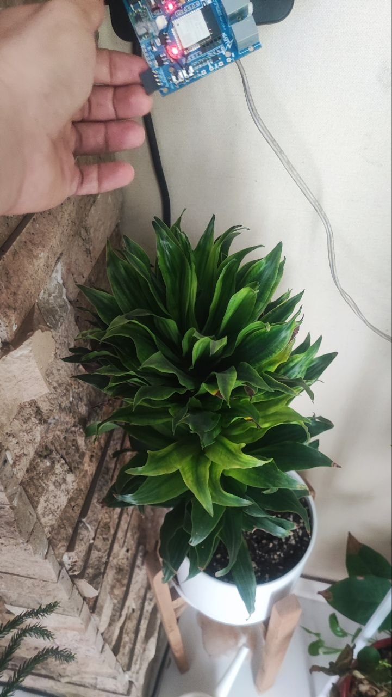
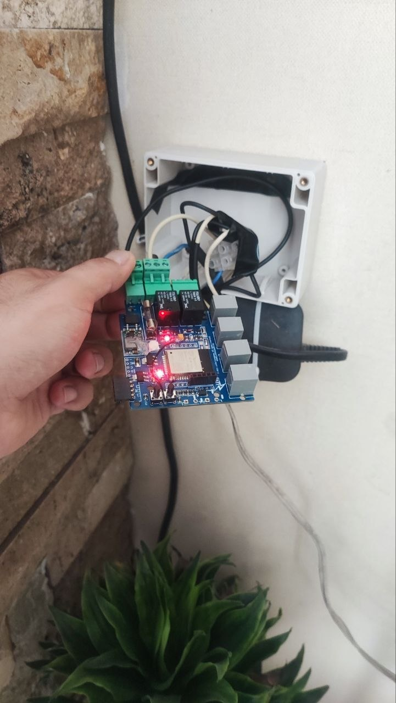
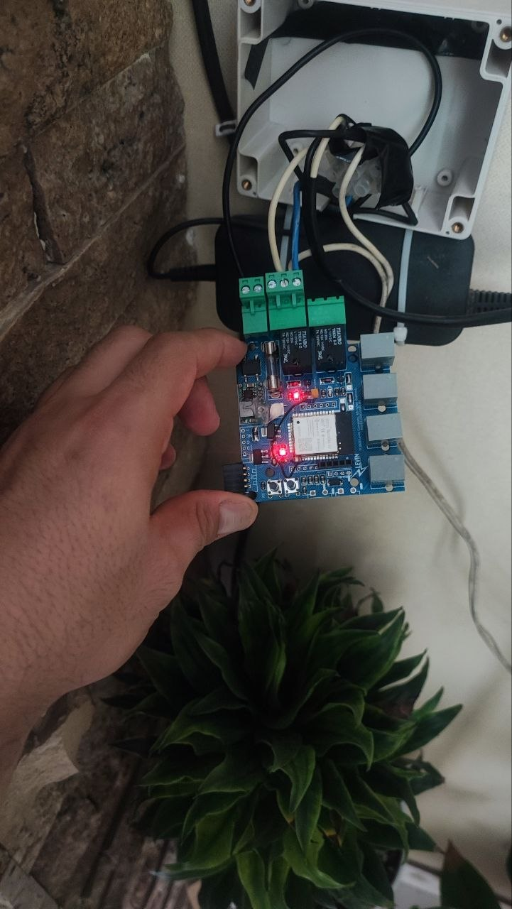
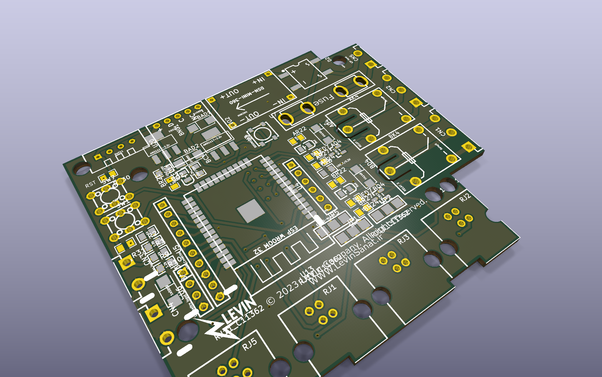

# Smart Flower Pot



An open-source ESP32 plant controller designed in EasyEDA, assembled, and tested at home for four years. This repository also provides an inspectable KiCad 10 conversion as a real EasyEDA-to-KiCad case study.

> **Status:** working prototype and reference design. The KiCad conversion preserves the source design, but imported ERC/DRC findings must be reviewed before a new manufacturing run. See [the migration audit](docs/EASYEDA_TO_KICAD.md).

## Highlights

- ESP32 Wi-Fi controller with two relay outputs
- DHT11 temperature and humidity monitoring
- Browser dashboard hosted on SPIFFS
- NTP time synchronization
- Original EasyEDA Standard JSON sources
- Editable KiCad 10 schematic and PCB
- Real assembly and long-term test photographs
- Machine-readable ERC/DRC reports and schematic PDF

## Gallery

| Operating controller | Home test | KiCad conversion |
| --- | --- | --- |
|  |  |  |

## Repository map

```text
firmware/esp32-web-controller/  Current firmware and web UI
firmware/examples/              Earlier reference experiment
Hardware/easyeda/               Original sources and previews
Hardware/kicad-10/              Editable KiCad 10 project
manufacturing/reports/          KiCad ERC and DRC results
docs/                           Guides and project photographs
```

## Quick start

1. Copy `firmware/esp32-web-controller/secrets.example.h` to `secrets.h`.
2. Add your Wi-Fi details; `secrets.h` is ignored by Git.
3. Install the ESP32 Arduino core, DHT library, and ESPAsyncWebServer dependencies.
4. Upload the `data` directory to SPIFFS, then flash `SmartFlowerPot.ino`.
5. Adjust the static network settings for your installation.

See [firmware instructions](docs/FIRMWARE.md) and the [hardware guide](docs/HARDWARE.md).

## EasyEDA and KiCad

The KiCad version was created with KiCad's native EasyEDA Standard importer, not redrawn from screenshots. The PCB import contains 71 footprints (including mounting-hole objects), 479 track segments, 48 vias, and two zones. After zone refill, KiCad reports zero unconnected PCB items.

Automatic conversion is not engineering sign-off. Imported library associations, symbol electrical types, silkscreen, courtyard, and design-rule conventions explain the recorded warnings. The reports remain visible so contributors can improve the conversion honestly.

## Safety

Relay contacts may carry dangerous voltages. This educational design has no certification. Disconnect power before handling it; use proper fusing, enclosure, strain relief, creepage, and clearance; and obtain qualified review for mains-voltage use.

## Contributing and license

Issues and pull requests are welcome; read [CONTRIBUTING.md](CONTRIBUTING.md). Hardware and manufacturing files use the strongly reciprocal [CERN-OHL-S-2.0](LICENSES/CERN-OHL-S-2.0.txt); firmware and documentation use the [MIT License](LICENSES/MIT.txt). See [LICENSE.md](LICENSE.md) for the scope of each license.

The early asynchronous web-server example retains its Random Nerd Tutorials attribution. Any original hardware project used as a basis must also be credited before release.
